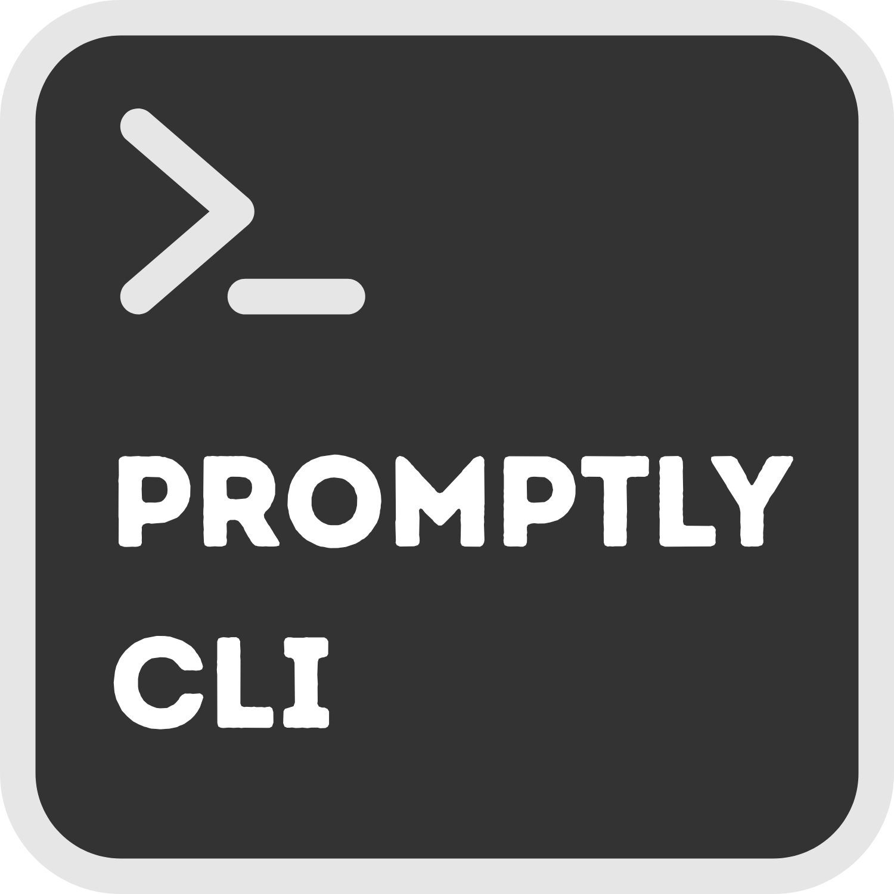

<div align="center">
    
</div>

<div align="center">
  <p>
    
    
    
    
    
    
    
    
  </p>
</div>

# Promptly CLI

A command-line interface for interacting with various AI language models.

## Features

- Single command interface for all AI providers
- Interactive chat mode
- Support for one-off queries
- Easy switching between providers and models
- Environment variable based configuration

## Installation

### Prerequisites

- Python 3.8 or higher

### Installation Steps

1. Clone the repository:
```bash
git clone https://github.com/thenry42/promptly_cli.git
cd promptly_cli
```

2. Run the installation script:
```bash
./install.sh
```

This will:
- Install the necessary dependencies
- Create a configuration file for your API keys
- Build an executable
- Add it to your PATH

### Setting Up API Keys

To use the tool with various AI models, you'll need to add API keys to the configuration file.

#### Option 1: During Installation

When you run the installation script, it will automatically create a configuration file and offer to open it for you to add your API keys.

#### Option 2: Using the Setup Script

You can run the setup script at any time to create or update your API keys:

```bash
./setup_keys.sh
```

#### Option 3: Manually Edit the Configuration File

The configuration file is located at:
```
~/.config/promptly_cli/.env
```

Add your API keys to this file in the following format:

```
OPENAI_API_KEY=your_openai_key_here
MISTRAL_API_KEY=your_mistral_key_here
ANTHROPIC_API_KEY=your_anthropic_key_here
GEMINI_API_KEY=your_gemini_key_here
DEEPSEEK_API_KEY=your_deepseek_key_here
OLLAMA_ADDR=http://localhost:11434
```

You can obtain API keys from:
- OpenAI (GPT models): https://platform.openai.com/api-keys
- Mistral: https://console.mistral.ai/api-keys/
- Anthropic (Claude): https://console.anthropic.com/
- Google (Gemini): https://ai.google.dev/tutorials/setup
- DeepSeek: https://www.deepseek.com/en/
- Ollama (local models): Install from https://ollama.com

## Usage

The tool provides a simple command-line interface:

```bash
# Run without arguments (displays help)
llm

# List available models
llm list

# Start a chat with a specific model
llm run [provider]/[model]

# Get help
llm help
```

## Uninstallation

To uninstall the application:

```bash
./uninstall.sh
```

This will:
- Remove the executable
- Remove the installation directory
- Optionally preserve your API keys configuration

## License

This project is licensed under the UNLICENSE. See the [LICENSE](LICENSE) file for details.

## Disclaimer

This project is not affiliated with OpenAI, Anthropic, Ollama, DeepSeek, Mistral, Gemini. It is a single person project. I personally use it as a tool to help me with my work and it's a good project for my portfolio. I do not claim to own any of the logos (or anything else for that matter) used in this project. All logos are property of their respective owners. Don't come after me with legal threats, nobody ain't got time for that. If you have any suggestions or feedback, please feel free to open an issue ! :smile: